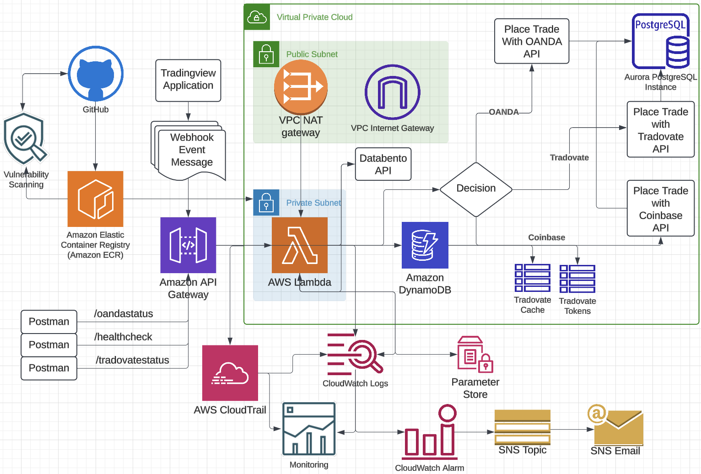

# AWS Automated Trading System

## Overview

This project implements an automated trading system that executes trades based on TradingView alerts using multiple brokerage API's such as OANDA for Forex, Tradovate for Futures and Coinbase for Cryptocurrency. The system uses a trend-following strategy with intelligent entry and exit management, implemented through a serverless architecture on AWS.

## Trading Strategy

### Core Components

1. Trade Execution (1-minute timeframe)

   - All entries and exits executed on 1-minute chart
   - Provides precise entry and exit points
   - Minimizes slippage on trade execution
   - Ensures responsive position management

2. Trend Validator (10-minute timeframe)

   - Primary trend direction indicator
   - Color changes trigger new trade entries
   - Blue indicates bullish trend
   - Red indicates bearish trend

This multi-timeframe approach combines:

- Quick execution (1-minute)
- Trend direction (10-minute)
- Momentum confirmation (15-minute)

### Strategy Logic

1. Entry and Exit Conditions:
   - Long Entry: Trend Validator turns Blue from Red
   - Short Entry: Trend Validator turns Red from Blue
   - Entry execution is immediate upon color change

2. Unique Broker Trade Flow:
   - Coinbase is spot trading so the buy flow is different than the sell flow
     - You can buy any amount of asset, but can only sell what amount is in the wallet
   - Tradovate and Oanda liquidate an existing position before opening a new position
     - Opposite direction trades cannot be entered simultaneously

## System Architecture

### System Overview Diagram



The above diagram illustrates the complete flow of the trading system, from TradingView signals to trade execution across multiple brokers.

### AWS Infrastructure

1. API Gateway & Webhooks
   - Regional endpoint for low latency
   - Handles TradingView webhook requests
   - Basic request validation and throttling
   - Dedicated endpoints: /oandastatus, /healthcheck, /tradovatestatus
   - Integrated with AWS Lambda through direct invocation

2. Lambda Function & Container Infrastructure
   - Hosted on Amazon Elastic Container Registry (ECR)
   - Source code managed through GitHub with vulnerability scanning
   - Deployed in private subnet with VPC NAT gateway access
   - Processes trading decisions using multiple broker APIs (OANDA, Tradovate, Coinbase)
   - Integrates with Databento API for market data

3. Database & Caching
   - Aurora PostgreSQL Serverless v2 for trade logging
   - DynamoDB for high-performance data storage
   - Dedicated Tradovate cache and token management
   - Multi-AZ deployment for high availability

4. Networking & Security
   - Virtual Private Cloud (VPC) with public/private subnet architecture
   - VPC NAT gateway for outbound internet access
   - VPC Internet Gateway for public subnet connectivity
   - Security groups and network ACLs for access control
   - Private subnet isolation for Lambda and database resources

5. Monitoring & Logging
   - AWS CloudTrail for API and resource auditing
   - CloudWatch Logs for Lambda function monitoring
   - Custom monitoring dashboard for system metrics
   - CloudWatch Alarms for critical system alerts
   - SNS Topic integration for email notifications

6. Security & Configuration
   - Parameter Store for secure credential management
   - Encrypted storage for broker API tokens
   - Secure token refresh mechanism for trading APIs
   - GitHub-integrated vulnerability scanning
   - Container image security scanning in ECR

7. Trading Integration
   - Multiple broker API support:
   - OANDA for forex trading
   - Tradovate for futures trading
   - Coinbase for cryptocurrency trading
   - Databento integration for market data feeds
   - TradingView webhook integration for trade signals

This infrastructure provides a secure, scalable, and highly available trading system with comprehensive monitoring and multiple broker integrations.

## Implementation Details

### Trading View Alerts Setup

The system routes trades to different brokers based on both the instrument type and exchange:

Broker Routing Rules:

OANDA: All Forex pairs (e.g., EUR_USD, GBP_JPY) with exchange = OANDA
Coinbase: All crypto pairs (e.g., BTC_USD, ETH_USD) with echange = Coinbase
Tradovate: All Futures contracts with their respective exchanges:

- CME: ES (S&P 500), NQ (Nasdaq)
- CME_MINI: RTY (Russell), MES (S&P 500), MNQ (Nasdaq)
- CBOT: YM (Dow)
- NYMEX: CL (Crude Oil)
- COMEX: GC (Gold), SI (Silver)

The webhook payload structure remains the same for both instrument types, with the routing logic handled by the Lambda function based on the symbol:

1. Long Entry

    ```javascript
    {
        "action": "LONG_ENTRY",
        "indicator": "Trend_Validator",
        "signal": {
            "type": "ENTRY",
            "direction": "LONG",
            "trigger": "COLOR_CHANGE_BLUE"
        },
        "market_data": {
            "symbol": "{{ticker}}",
            "exchange": "{{exchange}}",
            "timeframe": "{{interval}}",
            "timestamp": "{{time}}",
            "timenow": "{{timenow}}"
        },
        "price_data": {
            "open": "{{open}}",
            "high": "{{high}}",
            "low": "{{low}}",
            "close": "{{close}}",
            "volume": "{{volume}}"
        }
    }
    ```

2. Short Entry

    ```javascript
    {
        "action": "SHORT_ENTRY",
        "indicator": "Trend_Validator",
        "signal": {
            "type": "ENTRY",
            "direction": "SHORT",
            "trigger": "COLOR_CHANGE_RED"
        },
        "market_data": {
            "symbol": "{{ticker}}",
            "exchange": "{{exchange}}",
            "timeframe": "{{interval}}",
            "timestamp": "{{time}}",
            "timenow": "{{timenow}}"
        },
        "price_data": {
            "open": "{{open}}",
            "high": "{{high}}",
            "low": "{{low}}",
            "close": "{{close}}",
            "volume": "{{volume}}"
        }
    }
    ```

## Infrastructure Deployment

### Prerequisite Steps

- AWS Account
- Terraform installed
- AWS CLI configured
- TradingView Premium account
- OANDA account
- Tradovate account
- Coinbase Account
- Required IAM Permissions
- Parameter Store access:

  ```json
  {
    "Version": "2012-10-17",
    "Statement": [
      {
        "Effect": "Allow",
        "Action": [
          "ssm:GetParameter",
          "ssm:PutParameter"
        ],
        "Resource": "arn:aws:ssm:${region}:${account}:parameter/tradovate/*"
      }
    ]
  }

### Deployment Steps

1. Clone repository
2. Update variables in terraform.tfvars
3. Initialize Terraform:

    ```bash
    terraform init
    ```

4. Deploy infrastructure:

    ```bash
    terraform plan
    terraform apply
    ```

## Monitoring and Maintenance

### CloudWatch Metrics

- Lambda execution times
- Trade execution success rate
- Error rates and types
- API Gateway latency

### Alerts

- Lambda function errors
- High latency notifications
- Failed trade executions

### Maintenance Tasks

1. Regular Reviews:
   - Performance metrics
   - Cost optimization
   - Error patterns
   - Trade execution quality

2. Updates:
   - Lambda function code
   - Dependencies
   - Security patches
   - Infrastructure as needed

## Performance Considerations

### Latency Management

1. Components:
   - TradingView webhook delay (~100ms)
   - API Gateway processing (~10ms)
   - Lambda execution (~50-100ms)
   - OANDA/Tradovate/Coinbase API (~50-100ms)

2. Optimizations:
   - Regional endpoint usage
   - Lambda in VPC
   - Connection pooling
   - Efficient state management

### Cost Optimization

Approximate Monthly Costs:

1. AWS Service Costs:

    - Lambda: $5-10 (based on ~100k invocations)
    - NAT Gateway: $32 (single AZ)
    - API Gateway: $3.50-$7.00 (based on ~100k requests)
    - Aurora Serverless v2: $8-10
    - Parameter Store: Free for standard parameters
    - CloudWatch Logs: $1-2
    - DynamoDB: $2-5 (based on moderate usage)
    - Amazon ECR: $1-2 (container storage)
    - CloudTrail: Free (management events only)
    - SNS Email Notifications: Free (under 1000 emails/month)
    - CloudWatch Alarms: $1-2 (5-10 metrics)
    - CloudWatch Monitoring: $2-4 (custom metrics and dashboard)
    - Total AWS Costs: $58-76/month

2. External Service Costs:

    - TradingView: $15-$30 (different tiers available)
    - OANDA Account: Free (commission per trade)
    - Tradovate Account: $99/month (different tiers available)
    - Coinbase Account: Free (commission per trade)
    - Tradovate API Access: $25/month
    - Databento API: $0-$50/month (depends on live vs historical data)
    - GitHub: Free (public repositories)
    - Total External Costs: $189-204/month

3. Data Transfer Costs:

    - VPC Data Transfer: $2-5
    - API Gateway to Lambda: $1-2
    - CloudWatch Logs Transfer: $1-2
    - Total Data Transfer: $4-9/month
    - Total Estimated Monthly Operating Costs: $251-289/month

4. Notes:
    - Costs are estimates and may vary based on actual usage
    - Data transfer costs might increase with higher trading volumes
    - GitHub costs may apply if private repositories are needed
    - Additional costs may apply for increased market data coverage from Databento
    - Broker commissions not included as they vary by trading volume
    - AWS costs might be eligible for Free Tier benefits in first 12 months

## Security

### Network Security

- VPC isolation
- Security groups
- Private subnets
- NAT Gateway

### Data Security

- Secrets Manager for API keys
- Encrypted terraform state storage in S3
- Secure API endpoints
- Limited permissions
- Parameter Store for secure credential storage
  - Automatic encryption of sensitive values
  - Token lifecycle management
  - Access controlled via IAM

### Access Control

- IAM roles and policies
- Least privilege principle
- API authentication
- Resource isolation

## Future Improvements

1. Strategy Enhancements:
   - Position sizing logic
   - Multiple timeframe analysis
   - Risk management rules
   - Performance analytics

2. Technical Improvements:
   - Multi-region failover
   - Enhanced monitoring
   - Automated testing
   - Performance optimization

## Local Development and Testing

### Prerequisites

1. Install AWS SAM CLI:

   ```bash
   brew tap aws/tap
   brew install aws-sam-cli
   ```

2. Install ngrok for webhook forwarding:

    ```bash
    brew install ngrok
   ```

3. Configure AWS credentials with Parameter Store access:

   ```bash
   aws configure
   # Ensure your credentials have ssm:GetParameter and ssm:PutParameter permissions
   ```

### Local Testing Setup

1. Create a `template.yaml` in project root

    ```yaml
    AWSTemplateFormatVersion: '2010-09-09'
    Transform: AWS::Serverless-2016-10-31
    Description: Lambda function for trading automation

    Resources:
    TradingFunction:
        Type: AWS::Serverless::Function
        Properties:
        CodeUri: ./src/lambda/trading
        Handler: tradovate_token.lambda_handler
        Runtime: python3.12
        Timeout: 30
        MemorySize: 128
        Events:
            WebhookAPI:
            Type: Api
            Properties:
                Path: /webhook
                Method: POST
        LoggingConfig:
            LogFormat: JSON
            LogGroup: "/aws/lambda/trading-function"
            RetentionInDays: 30
    ```

2. Start local API endpoint

    ```bash
    sam local start-api
    ```

3. In a separate terminal, start ngrok

    ```bash
    ngrok http 3000
    ```

4. Configure webhook forwarding:

   - Copy the ngrok URL (e.g., <https://abc123.ngrok.io/webhook>)
   - Go to webhook.site
   - Set up forwarding rules to your ngrok URL

### Testing Workflow

1. Send test webhook from TradingView:

    ```javascript
        {
        "action": "LONG_ENTRY",
        "indicator": "Trend_Validator",
        "signal": {
            "type": "ENTRY",
            "direction": "LONG",
            "trigger": "COLOR_CHANGE_BLUE"
        }
    }
    ```

2. Monitor local logs:

   - SAM CLI will show Lambda execution logs
   - webhook.site shows incoming webhook data
   - ngrok interface shows request/response details

3. Debug locally:

   - Full access to local Lambda environment
   - Real-time log viewing
   - Quick iteration on code changes

### Common Issues

1. Parameter Store Local Testing:
   - Use environment variables for local testing:

     ```bash
     export TRADOVATE_USERNAME=your_username
     export TRADOVATE_PASSWORD=your_password
     export TRADOVATE_APP_ID=your_app_id
     export OANDA_SECRET=your_oanda_secret
     export OANDA_ACCOUNT=your_oanda_account
     export COINBASE_API_KEY_NAME=your_coinbase_api_key_name
     export COINBASE_PRIVATE_KEY=your_coinbase_private_key
     ```

   - Mock Parameter Store responses when needed:

     ```python
     class MockParameterStore:
         def __init__(self):
             self.parameters = {}
         
         def put_parameter(self, Name, Value, Type, Overwrite=False):
             self.parameters[Name] = Value
             
         def get_parameter(self, Name, WithDecryption=False):
             return {
                 'Parameter': {
                     'Value': self.parameters.get(Name, '')
                 }
             }
     ```

2. Connectivity:

    - Ensure ngrok is running and URL is current
    - Check webhook.site forwarding rules
    - Verify local API is running on port 3000

3. Permissions:

    - Local execution uses your AWS credentials
    - Ensure proper IAM permissions
    - Test with appropriate role assumptions
